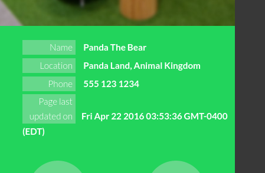

# DOM Manipulation with Panda the Bear
## Getting Started
0. Clone this repo and open this readme in your text editor.

1. Go to [http://bitmakerlabs.github.io/panda-the-bear-js/index.html](http://bitmakerlabs.github.io/panda-the-bear-js/index.html) in your browser.

2. Open the JavaScript console.

3. Experiment with writing JavaScript code to do each of the tasks listed below.  You should have the [jQuery documentation](http://jquery.com/) open as you work and don't be afraid to google.  Make sure to ask for help if you’re stuck for more than 10 minutes!  

4. When you find a solution that works, paste it into this document below the question and make a commit.

### Review
Remember, jQuery uses CSS-style selectors in order to target parts of the webpage (ie. the DOM).  If you need a review of that syntax, here's [a helpful guide](https://developer.mozilla.org/en/docs/Web/Guide/CSS/Getting_started/Selectors).

You should be comfortable selecting elements by tag name (eg. 'h1'), class name (eg. '.special-class'), id (eg. '#super-special-id'), as well as writing descendant selectors (eg. 'header h1').

## Hacking Panda the Bear's Resume

1. Select the element that contains the profile image (hint: look for the class).  Change the `src` attribute so it points to a picture of your choosing instead (hint: use [attr()](http://api.jquery.com/attr/)).

  PROTIP: use the inspector to learn the dimensions of the current profile image and use a placeholder image service such as [Place Kitten](https://placekitten.com/) to get an image of the same size.

2. Use the same approach to select the element that contains the photo of the sky and change the `src` attribute to another picture URL of your choosing.

3. Select the heading that says "Panda the Bear" and change it to your own name. (hint: use [text()](http://api.jquery.com/text/))

4. Select the heading that says "Employment" and change it to something else. (hint: use a [descendant selector](https://developer.mozilla.org/en-US/docs/Web/CSS/Descendant_selectors))

5. Panda the Bear is lying about their skills!  Take the "time travel" skill off the page to satisfy your personal sense of justice.  Use your googling and docs-skimming skillz to find a jQuery function that will allow you to remove elements from the DOM.  (hint: there are multiple ways of doing this, but the [parent()](http://api.jquery.com/parent/) function might be useful when it comes to selecting the right element)

6. Change the colour of the body. (hint: use [css()](http://api.jquery.com/css/))

7. Change the colour used by the `highlight` class.

8. Change the font family of the h1 to 'monospace'.

9. Find a way to select the round icons in the sidebar and then change their colour.

10. Scroll down to the contact form.  Change the placeholder attribute of the name field to "identify yourself".

11. Change the placeholder attribute of the message field to "state your business".

12. Give the name field [a "value" attribute](http://www.w3schools.com/tags/att_input_value.asp) of "your nemesis".

13. Change the value attribute of the email field to "koalathebear@gmail.com".

14. Change the value of the submit button on the contact form to "En garde!".

  Bonus points: try experimenting with both the attr() function and the val() function to find different ways of doing this.

15. We should stop Koala from sending an email to Panda that they might regret!  Find a way to disable the submit button (hint: familiarize yourself with the [disabled attribute](http://www.w3schools.com/tags/att_input_disabled.asp)).

16. We should help Panda protect their privacy by clearing their personal details from the sidebar.  You can use [empty()](https://api.jquery.com/empty/) to do this.

### Adding Elements to the DOM

17. That drawing of Pikachu is really cute.  Let’s duplicate it using [clone()](https://api.jquery.com/clone/) and insert it at the bottom of the page using [insertAfter()](http://api.jquery.com/insertafter/) or [appendTo()](http://api.jquery.com/appendto/).

18. Wow, that was so satisfying I think we should do it 10 more times.  Use a `for` loop to help you do this.

19. Let’s add a message about when the page was last updated.  We'll do this by appending a new `<li>` element to the `<ul>` in the sidebar (you might need to refresh the page to bring back the list items that we emptied out earlier).  

  

  [document.createElement](https://developer.mozilla.org/en-US/docs/Web/API/Document/createElement), [document.createTextNode](https://developer.mozilla.org/en-US/docs/Web/API/Document/createTextNode), and [appendChild](https://developer.mozilla.org/en-US/docs/Web/API/Node/appendChild) are the keys to this process\*.

  First we need to construct a new `<li>` tag.

  `var listItem = document.createElement('li');`

    It isn't part of the DOM yet, it's just floating in the void.  We'll eventually attach it to the `<ul>` in the sidebar, below Panda's name, location, and phone number.

   Now we need a new `` tag to go inside the `<li>` we just made.  This span will eventually go in the left column below 'Phone'.

  `var leftSpan = document.createElement('span');`

  Next we need to make a "text node" in order to put text inside our new span.  A text node is a chunk of plain text that lives inside some HTML tag in the DOM.

  `var lastUpdated = document.createTextNode('Page last updated on');`

  We're ready to put that new text node inside our new `` using `appendChild`.

  `leftSpan.appendChild(lastUpdated);`

  And we'll put the `` inside the `<li>`, again using `appendChild`.

  `listItem.appendChild(leftSpan);`

  At this point our new elements are attached to each other but are still floating in the void separate from our webpage's DOM.

  It's up to you to go through the same process for the second span that will go in the right-hand column of the `<ul>` (below Panda's phone number).  Look up the docs for the `Date` class to find a way of displaying the current date inside your next text node.

  After that, find a way of selecting the `<ul>` and append the new `<li>` to it.  For bonus marks, apply the correct classes to these new elements of yours so the styling is consistent with the rest of the list items.

\* you may notice that these functions are vanilla JavaScript and do not come from jQuery

## Stretch Exercise:
Sometimes you'll run into situations where you have to get by without jQuery.  Try to find vanilla JavaScript alternatives to each of your answers that use jQuery functions.
